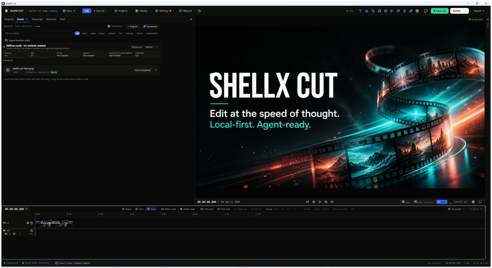
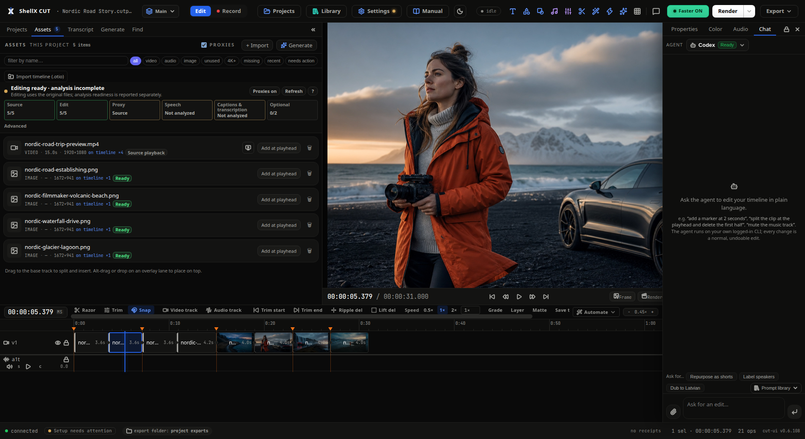
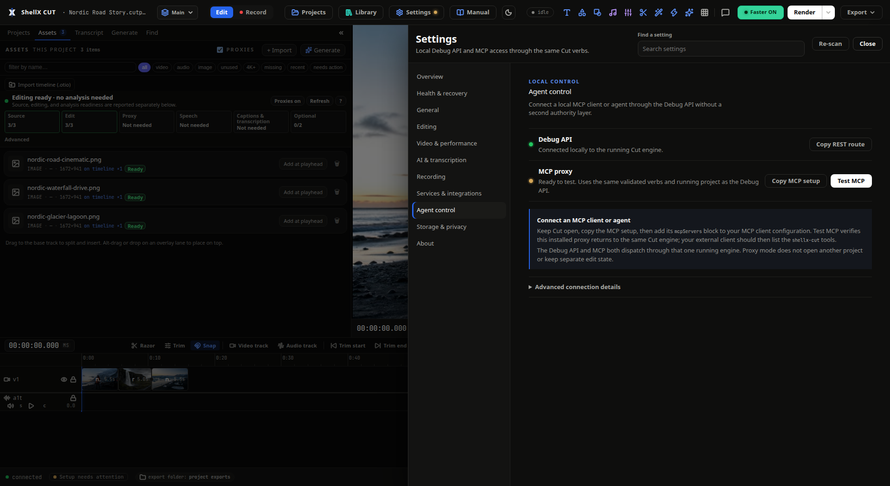

# ShellX Cut

**Agent-first video editor.** An agent and a human co-edit one timeline through
the same verb API. Every change, human or agent, is an operation in an
append-only log with a rationale. AI passes are reviewable, scoped, reversible
diffs, and "done" requires measured evidence: render receipts, deterministic
checks, sampled-frame review, transcript timing, loudness, silence, and delivery
facts. ShellX Cut makes the edit itself a verifiable object instead of treating
AI output as an opaque final file.

> **STATUS — 0.6.106 release line.** The public contract is 260 verbs across 32
> domains. REST and MCP coverage are enforced by `scripts/coverage-audit.sh`,
> typed UI bindings are enforced by `scripts/verbargs-sync.sh`, and the full
> agent reference is in `skill/shellx-cut/reference.md`. Current major surfaces
> include Projects, Library, native editable Generate, transcription with
> Parakeet/Canary/Whisper tiers, dubbing, diarization, render verification,
> review comments, Recording Studio workflows, and setup cards for installable tools and
> model runtimes. Provider-backed media generation remains optional via the
> user's own CLI; native Generate produces editable timeline elements through
> normal ops.

## See ShellX Cut in action



| Edit with an agent in plain language | Connect any MCP-capable coding agent |
| --- | --- |
|  |  |

## Quickstart

Contract first: read `docs/public/FEATURES.md` for the public feature inventory and
`schema/verbs.json` for the verb registry, which is the source of truth for the
debug/API contract. The user manual lives at
`https://docs.theshellx.com/manual/cut/` and is linked from the Cut topbar; app
surfaces can deep-link into it with feature ids such as
`?feature=cut.left.media_health`.
Agent workflow details and full arguments live in `skill/shellx-cut/SKILL.md`
and `skill/shellx-cut/reference.md`. Build prerequisites (Rust, Node, ffmpeg,
jq, and Linux capture/audio development headers) plus the full verification
gate list are in `docs/public/BUILDING.md`.

The first-run path is project-first and format-light: Projects is the initial
workspace, and dropping a video, audio file, or image when no project is open
creates a sensibly named project and places the media on its timeline. A new
project does not ask a beginner to choose resolution or frame rate. Its first
video adopts the source geometry and frame rate; those are timeline composition
properties available later under Render > Timeline. Delivery aspect, output
size, codec, and bitrate remain per-render/export choices, so one edit can
produce multiple deliverables without recreating the project.

```bash
scripts/dev.sh                  # build ui/ bundle, run cutd serving it at 127.0.0.1:6161
scripts/dev.sh --headless       # API-only, no UI build (background-run friendly)
scripts/e2e.sh                  # definition of done — full source pipeline
scripts/coverage-audit.sh       # asserts every verbs.json verb answers on REST + MCP (260/260)
node scripts/schema-validation-parity.mjs
                                # exact invalid-argument parity across direct dispatch, REST, CLI, and MCP
scripts/verbargs-sync.sh        # asserts every verbs.json verb has a typed UI client binding
node ui/public-tests/full-coverage-verify.mjs --coverage-check
                                # pure check: every verb is covered or explicitly non-UI
node --test scripts/public-tests/feature-contract.test.mjs
                                # pure check: feature list, skill/reference, README, and debug/test harness stay synced
# With a disposable local app stack running:
SWEEP_APP=http://127.0.0.1:6161 SWEEP_CUTD=http://127.0.0.1:6161 \
  npm --prefix ui run verify-accessibility-surfaces
                                # live check: every agent-openable surface has named, focusable controls
scripts/make-test-assets.sh     # espeak-ng+ffmpeg → testdata/ with known ground truth

# cutd directly (cargo run -p server --manifest-path app/Cargo.toml -- …):
cutd serve --project x.cutproj --headless   # REST+WS server, UI optional
cutd serve --addr 127.0.0.1:6169 …          # non-default port (loopback only); all 6161 URLs below shift accordingly
cutd mcp                        # MCP over stdio; PROXIES a running serve (the single-state-holder contract)
cutd verb project.state '{}'    # one-shot CLI escape hatch
```

REST: `POST /api/verb/{name}` · `GET /api/state` · `GET /api/frame?at_ms=` ·
WS events at `/api/events` · UI served at `/`. MCP tools are generated from
`schema/verbs.json` (dots→underscores). Full endpoint catalog, MCP client
config, and the security model in `docs/public/DEBUG_API.md` — cutd is
**loopback-only by design, no API token**: it refuses non-loopback binds and
rejects cross-origin/DNS-rebind requests; `SHELLX_CUT_ALLOW_NON_LOCAL=1` is the
only opt-out and belongs behind an authenticating reverse proxy.

## Verb API (260 verbs, 32 domains — `schema/verbs.json` is the contract)

Envelope: `{ok, result?, op_ids?, warnings?[], error?{code,message,clip_id?,at_ms?,cause,suggested_action?}}`.
Every mutating verb takes optional `rationale`. Long tasks return `{job_id}`.
Representative verbs per domain below — `skill/shellx-cut/reference.md` is the
full 260-verb table.

| Domain | Verbs | Notes |
|---|---|---|
| **project** | create · open · save · state · **sequence_list · sequence_index · sequence_create · sequence_switch · sequence_rename · sequence_delete** · ops · checkpoint · revert · diff · **rename · brand** · close · **list** · **forget** · **delete** | each project can hold independent sequences with scoped undo/checkpoints while sharing media; **sequence_index searches path-light clip/marker metadata across every active and inactive timeline, filters live offline media/gaps/effects/hidden/locked/muted tracks, copies the bounded table as spreadsheet-safe CSV, and navigates results from Find → Sequence**; checkpoint/revert ARE ops; revert appends, never rewrites; rename and brand are durable non-timeline metadata ops; **brand stores delivery constraints used automatically by verify.brand and render.bundle**; **list = recent-projects index (~/.shellx-cut/projects.json), reopen by path; forget drops the index entry (≠ delete); delete PERMANENTLY removes the `.cutproj` dir + forgets it (guardrailed: only `*.cutproj`, never the open project)** |
| **library** | **list · add · remove · move · tag · favorite · use · add_to_project · folder_add · folder_rename · folder_remove** | global cross-project media library (~/.shellx-cut/library/): video/audio/image, folders + tags. HYBRID storage (link original by path, or copy:true → content-addressed stored copy); kind is ffprobe-derived; add_to_project reuses media.import. Assets is project-local; human Assets imports mirror explicitly, while agent imports use `library.add {asset}` only when cross-project reuse is intended. Blobs served fenced via /api/library-blob |
| **assets** | providers · search · fetch · generate · generated_list | local/provider media discovery and immutable generated-take history; optional provider calls use the user's configured CLI and normal project import paths |
| **media** | import · **remove** · probe · transcribe · perception · waveform · **filmstrip** | import kicks probe→proxy→filmstrip→**ready-to-edit** (fast); transcribe+perception run as a separate background **enrich** job (`enrich_job` in the result) so slow transcription never blocks editing; first import auto-places onto an empty timeline; filmstrip = per-clip timeline thumbnails; **remove = the inverse of import — drop an asset from the open project + unlink its regenerable proxy/thumbnails (source file kept, replay-safe; refuses while clips still use it)**; the Assets tray includes Media Health for missing sources, proxy/source playback state, and one-click relink |
| **jobs** | status · list · cancel | one job model for transcribe/perception/render/judge, with explicit cancellation for active tasks |
| **edit** | split · ripple_delete · trim · move · insert · gain · **speed** · **grade** · **grade_stack** · **color_match** · **auto_balance** · crop · transform · fade · crossfade · duck · **auto_zoom** · multicam_sync · **multicam_switch** · add_track · split_at_scenes · mark_scenes · trim_edges · add/remove/move_marker · restore | linked imported picture/sound move and trim atomically by default (`linked:false` deliberately separates them); restore = undo/reject (tip or rebase); speed = per-clip retime; grade = color; **grade_stack** = LAYERED grading (a node-stack of grade layers applied in order on one clip — a serial grading workflow; empty/single-layer stays byte-identical to a plain grade); **color_match** = match a clip's colour to a reference clip (derives + applies a grade); **auto_balance** = one-click REFERENCE-FREE auto white-balance + exposure (the "Auto Color" sibling — neutralises the clip's own cast, no reference; derives + applies a grade); **auto_zoom** = emphasis-driven punch-in zooms (loud beats / sentence starts → scale keyframes); multicam_sync = audio-align angles, **multicam_switch** = auto-cut the program to the active-speaker (loudest) angle over time |
| **effects** | list | read the built-in effect catalog used by Inspector and agent workflows |
| **transitions** | list | read the supported transition catalog before applying timeline transitions |
| **grade** | **save · apply · list** | grade GALLERY (the grade gallery — "copy a look between shots"). **save** snapshots a clip's current grade as a named project preset; **apply** copies a saved look onto a target clip (lowers to a replay-safe `edit.grade`); **list** reads the gallery. Pure data — `save` is a non-timeline metadata op, `apply` is the undoable per-clip grade |
| **audio** | add_music · cleanup_voice · **dub** | music bed + auto-duck under speech + beat:N markers; **dub = native AI dubbing — re-voice an asset's speech into another language in a cloned voice, time-fit to the original, added as a NEW audio track (original kept); reuses transcript.translate, synthesizes via the OmniVoice TTS service (CUT_DUB_ENDPOINT)** |
| **transcript** | get · cut_words · **ignore_words** · remove_silences · remove_fillers · search · assemble | text-based editing; never cuts inside a word; `ignore_words` hides selected source words from transcript-derived captions/reels without cutting or muting; `aggressiveness` REQUIRED on remove_silences; assemble builds a highlight reel |
| **captions** | generate · add_text · **kinetic** · set_style · set_range · shift · reflow | static burn-in + animated (kinetic); reflow satisfies verify.captions |
| **title** | **add** | native motion-graphics title (resvg, in-house) — animated, distinct from captions.add_text's static card |
| **shape** | update | update a placed native shape without recreating its clip identity |
| **generate** | **list · describe · preview · insert · from_prompt · storyboard** | native editable Generate workspace beside Library: built-in templates, Motion-backed rendered templates through `motion.template_to_cut`, scripted-video renders through `motion.script_to_cut`, and attested/idempotent connector plans through `motion.map_import` / `motion.apply_import`; current SDK renders carry verified two-/five-hash package lineage and replay-backed path-free origin attestations, while an optional current package is independently reported as `exact`, `changed`, or `unavailable` and older connector plans are labeled `legacy-unverified`. Motion receipt `warning` is accepted as successful with deduplicated advisories; failed receipts are rejected. Supported Motion backgrounds/text/shapes plus opacity and x/y position automation arrive as normal editable Cut objects with stable source-layer bindings and changed plans update those objects in place, while unsupported constructs retain rendered-media fallback. Background apply is cancellable through `jobs.*`; distinct from `assets.generate`, which imports provider-backed media from the user's own generation CLI |
| **motion** | **job.get · job.list** · link.refresh · link.relink · link.edit · **link.tracking.inventory/request/inspect/apply/verify/detach** | Motion-backed renders can be named with `job_id` and observed live from another request without exposing cross-caller scope: `pending` is waiting for capacity, `running` is active, and polling stops when `pollAfterMs` disappears. Linked Motion clips keep a last-good rendered Cut fallback while Canvas owns rich source editing. Cut supplies a stable path-private workspace caller id, distinguishes deliberate render cancellation from retryable machine-busy queue timeouts, and retains the supported on-disk Motion render receipt path on refresh. The Inspector exposes bounded path-free keying/roto facts, can run local point/planar analysis on package footage, compile stabilization to ordinary Motion keyframes, verify or detach it, and only updates pixels after an explicit receipt-verified refresh. Tracking uses normalized seeds, copy-on-write packages, fixed argv, and identity/race checks |
| **render** | preview · frame · final · **reframe** · storyboard · **bundle** · **queue** | `frame` = agent's eyes; `final` auto-runs verify.checks → RenderReceipt; `final` does multi-format STATIC geometry (`aspect`/`width`/`height`, centre-crop) + `format` (h264/hevc/vp9/prores/av1) + GPU `hardware` tier + rate-targeted `bitrate`/`rate_control` (vbr/cbr) + `normalize_loudness`; **`reframe` = subject-aware auto-reframe (local CV detect+track → moving crop that FOLLOWS the subject; honest lossy-crop receipt) — the honest alternative to a static centre-crop**; **bundle = social repurposing: one window → publish-ready pack per platform (reframe + windowed captions srt/vtt + thumb + receipt)**; **queue = BATCH DELIVERY (a batch render queue): fan the current timeline out into N renders with per-entry settings (`output`/format/preset/bitrate/geometry/loudness), run SEQUENTIALLY through the same `render.final` path (memory-safe — N at once would multiply peak RSS); a pure delivery orchestrator (no op, no checkpoint), entries validated up front by a dry_run; per-entry job_ids + receipts land in the queue job result** |
| **clip** | **candidates** | rank the windows most likely to work as standalone short-form clips (honest heuristic: opening-hook + retention proxy) — read-only, feeds render.bundle |
| **score** | clip | model-free engagement scoring used to explain and rank clip candidates |
| **assemble** | repurpose · shorts · from_script · broll | human-visible Assemble workflows for highlight selection, short planning, script-to-footage matching, and b-roll placement; every applied result remains normal timeline ops |
| **autopilot** | **run** | workflow: render → verify → MECHANICALLY self-fix from the receipt's fix_actions → re-verify, capped, under one auto-checkpoint (one-step revert). policy:preview (plan only) \| auto_low_risk (apply). Never fakes a pass; no-progress guard |
| **recipe** | **list · describe · run** | declarative pipeline MANIFESTS — named, gated WORKFLOWS over the existing verbs (built-ins in `schema/recipes.json`: a guided first edit; preview-first **Edit for clarity** with intensity; podcast/talking-head/screen-demo/phone cleanup; social bundle; privacy mask; captions; YouTube and TikTok export). list/describe are pure reads; **run is a PURE ORCHESTRATOR** (like autopilot.run/audio.cleanup_voice): no op of its own, ONE auto-checkpoint (one-step revert), dispatches each stage through the normal verb path, polls sub-jobs, evaluates a per-stage gate (receipt checks and/or render-free state facts), and STOPS + reports on the first failed verb or gate. policy:dry_run returns the resolved PLAN without dispatching (pre-render-gate seam) |
| **screen_record** | doctor · start · stop · **studio_event** · autoedit · polish · export | Recording Studio: screen capture with microphone/system audio, raw stream preservation, timed background/marker metadata, auto-edit plan generation, and content-addressed polish onto the timeline. Live camera capture is explicitly unavailable in this release; the downstream auto-edit/compositor can still use an existing project-local camera file supplied by an agent. |
| **verify** | checks · judge · pregate · pacing · captions · delivery · brand | checks = deterministic instrument battery (post-render); judge = pluggable watch+listen reviewer (job; normalized approve/reject/advisory outcome); **pregate = PRE-render predictive gate — flags likely render problems from the EDL + cached perception facts WITHOUT spending a render**; pacing/captions/delivery/brand = read-only QC receipts |
| **export** | xml (fcpxml/premiere/resolve) · srt · vtt · chapters · transcript · frame · range · **audio** · **gif** · **publish** | file-writing paths are FENCED (the output-fencing contract); users can set a default export folder or use per-export Save As, default-name collisions auto-suffix, and confirmed Save As targets can replace existing export media/sidecar files; frame/range extract a still / a timeline window AS reusable assets; **audio = timeline mix as mp3/m4a/wav/flac/opus; publish = one-click platform export (youtube/tiktok/reels/x/…) using platform geometry and bitrate presets through render.final** |
| **import** | otio | hash-bound OTIO preflight and one-operation timeline replacement; the desktop UI owns the native picker/confirmation while agents pass an explicit path |
| **comment** | add · list · draft · apply · resolve | review-to-change loop: timecoded notes → agent drafts verb changes → apply (auto-checkpointed) |
| **agent** | chat | launch the user's configured subscription CLI against the same MCP-backed live project and return a bounded review/revert handoff |
| **ui** | state · screenshot · open · playhead · select · highlight | ui.screenshot is a verification PRIMITIVE — agent sees the app from anywhere; open/playhead/select/highlight return `ok:true` only after the exact UI client commits observable state; no-op/unavailable/disconnected requests fail explicitly; one shared registry covers human and agent surface routes |
| **debug** | screenshot | compatibility screenshot primitive for external harnesses; normal agents should prefer `ui.screenshot` |
| **plugins** | list · enable · call | agent-only scoped-dispatch fence over the same registry; `plugins.list`, `plugins.enable`, and `plugins.call` expose built-in Openverse-assets and matte-runtime capabilities without creating a parallel API |
| **system** | **system.mcp_test · system.doctor · system.fetch_tool · system.setup_perception · system.setup_matte · system.set_ffmpeg · system.set_stt_model** | Agent control plus environment/setup cards: Settings > Agent control discovers the exact installed executable, copies a ready MCP client config, and runs a read-only initialize/ping/tools/list/same-engine proxy check; capability cards cover ffmpeg, perception/STT, matte, dubbing, diarization, judge CLIs, and disk health; setup remains consented and local-first |

WS events: `op_applied · job_progress · render_done · receipt_ready · project_changed · ui_state · doctor_updated`
— `receipt_ready` always follows `render_done`; agents key on `receipt_ready`.
`project_changed` keeps visible clients synchronized when REST, CLI, or MCP
creates, opens, or closes the active project.
`doctor_updated` refreshes setup/status surfaces when detected capabilities
change.

## Network activity

ShellX Cut is local-first. Projects, media, edit history, previews, and normal
renders stay on the machine. Optional generation, dubbing, review, stock-media,
or agent-provider workflows make network requests only when the user starts
them.

The installed desktop app on Windows and macOS also contacts GitHub by default
to read the signed release feed: once at launch, then once every 6 hours while
the app stays open. GitHub receives normal request metadata such as the IP
address; Cut adds no project, media, edit-history, or analytics payload.
Finding an update never interrupts the session — it only shows a quiet topbar
button and the update status in Settings > About, and installing an available
update still requires confirmation. Automatic checks can be turned off under
**Settings > Storage & privacy > Network activity**; the choice is stored by
the native shell, applies immediately to both the launch and periodic checks,
and the manual "Check for updates" button in Settings > About keeps working.
Linux packages (deb/rpm) skip the launch and periodic update checks entirely —
updates arrive as new package downloads — so a Linux launch makes no GitHub
request at all.
Windows and Apple-silicon macOS updates are signature-verified before install;
the release feed is generated only from both verified platform artifacts and
version-bound GitHub release URLs. Source-build and release steps are documented
in [`docs/public/BUILDING.md`](docs/public/BUILDING.md#signed-updater-feed).

## Security

Read [`SECURITY.md`](SECURITY.md) before exposing the Debug API beyond
loopback or enabling unattended agent control. The policy explains how to
report vulnerabilities privately, what the local API trusts, and why
`agent.chat` review and revert controls do not constitute an operating-system
sandbox.

## Architecture

```
app/  cargo workspace
├── core/        cut-core: project model, op-log, EDL, checkpoints, diff, receipt types
├── media/       cut-media: ffprobe/proxy/render via ffmpeg subprocess; ASS caption burn-in
├── export/      cut-export: NLE interchange — FCPXML 1.11 (FCP/Resolve) · xmeml v5 (Premiere) · SRT
├── perception/  cut-perception: instrument orchestration + deterministic receipt checks
│   └── py/      python sidecar: Parakeet/Canary/Whisper words, silero-vad, PySceneDetect, WAV-energy beats, ebur128
└── server/      cutd: axum REST+WS on 127.0.0.1:6161 + MCP + jobs + static ui/dist

ui/   Vite + React + TS — an API client, NOTHING more. Zero local mutation:
      every interaction dispatches a verb; state arrives over WS. Panels:
      Timeline · Preview · project-local Projects/Assets/Generate/Transcript tabs ·
      dedicated cross-project Library workspace · Review rail · status bar.
      Design follows the ShellX Cut feature workflow and the local UI rules:
      compact operational panels, stable selectors, wired controls, and
      advanced diagnostics hidden until needed.
```

Headless-first: `cutd` runs without UI; open the UI at any moment and see live
state. Renders are deterministic (fixed encoder params, no wall-clock
metadata): same input + EDL ⇒ same output hash.

## The receipts model (the whole point, in 10 lines)

1. Every mutation goes through a verb; every verb appends an immutable op
   record to `ops.jsonl` — actor, args, **rationale**, effects, inverse.
2. `project.json` is only a cache, rebuilt from the log on demand.
3. Undo/reject = `edit.restore` appends a NEW op; history is never rewritten.
4. Checkpoints are pointers into the log; diff = ops between two pointers.
5. Imported assets get `perception.json`: measured facts (word timestamps,
   silences, scenes, beats, LUFS) from local instruments.
6. `render.final` auto-runs `verify.checks` — deterministic Rust checks over
   EDL × facts × output (cut_on_word, lufs, caption_presence, black/frozen
   frames, silence_at_edges, duration_matches_edl) → **RenderReceipt**.
7. `verify.judge` adds the perceptual layer: the bundled access ladder drives
   the user's subscription CLI — Claude → Codex → Antigravity → Grok — as a
   subprocess that reviews sampled frames with deterministic instrument facts
   (LUFS, silences, word timings) as the measured ground truth — a VISUAL judge
   (`listened:false`), not yet a true audio-model listen. Never fakes a pass:
   an auto-selected CLI that fails infrastructure checks falls through to the
   next rung; no usable CLI/runtime ⇒ structured `not_run`. An explicit
   `CUTD_JUDGE_ADAPTER` remains available as an operator/test override; ordinary
   installed users do not configure it. The agent never claims success without
   the receipt.

## Repo map

| Path | What |
|---|---|
| `app/` · `ui/` | Rust workspace + React UI (see Architecture) |
| `schema/` | verbs.json (verb registry, source of truth) · ops.schema.json |
| `docs/public/` | feature inventory/workflow, build/debug guides, test-rig contract, and ShellX Motion boundary |
| `scripts/` | public build, development, release-check, and packaging tools |
| `scripts/public-tests/` · `ui/public-tests/` | deliberately public deterministic and UI verification suites |
| `scripts/private/` | working-repository-only demo and operational helpers; never exported |
| `skill/shellx-cut/` | agent tool skill (SKILL.md + reference.md) + craft/ layer (11 editing-craft guides: talking-head cleanup, podcast, screen-demo, pacing…) |
| `branding/` | selected ShellX Cut vector and raster icon masters |

## License

ShellX Cut is MIT licensed (see `LICENSE`). Shipped third-party model and font
assets use permissive licenses recorded, with source hashes and license texts,
in `NOTICE`.

FFmpeg is not included in ShellX Cut installers. Users can provide a compatible
system copy or explicitly ask Cut to download a separate BtbN GPL build on
supported platforms; that external runtime keeps its own license and runs as a
separate process. See `NOTICE` for the exact boundary and upstream links.

## Credits

Created by Martins Brezauckis. ShellX Cut edits locally on your machine and
can be co-driven by AI agents — Claude Code, Codex, Grok, or any REST/MCP
client — through the same validated verb surface the UI uses. Third-party
models and fonts shipped inside installers are credited, with license texts
and source hashes, in `NOTICE`.
