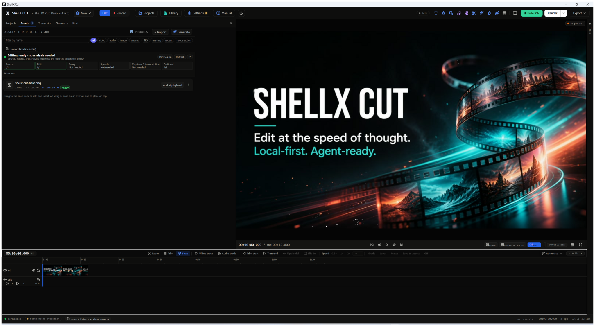
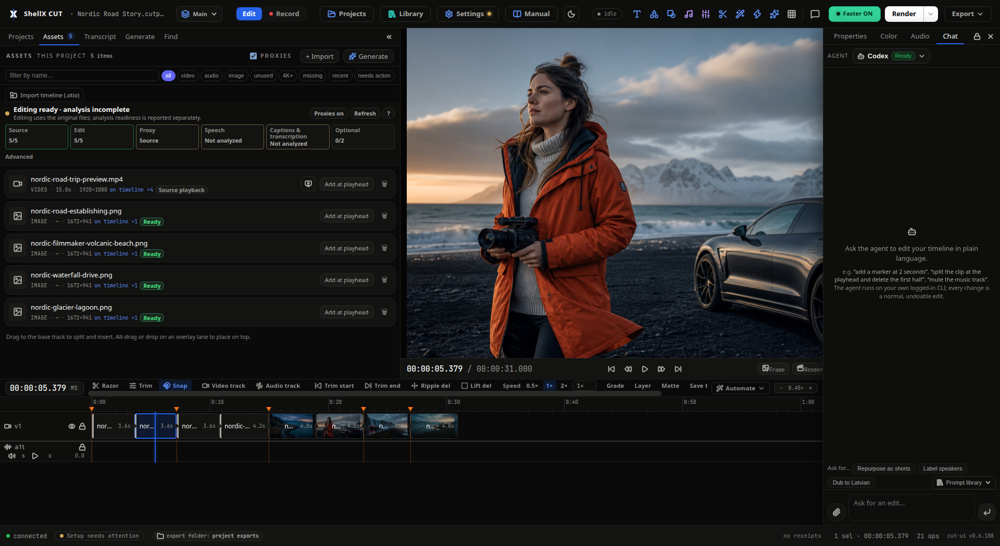
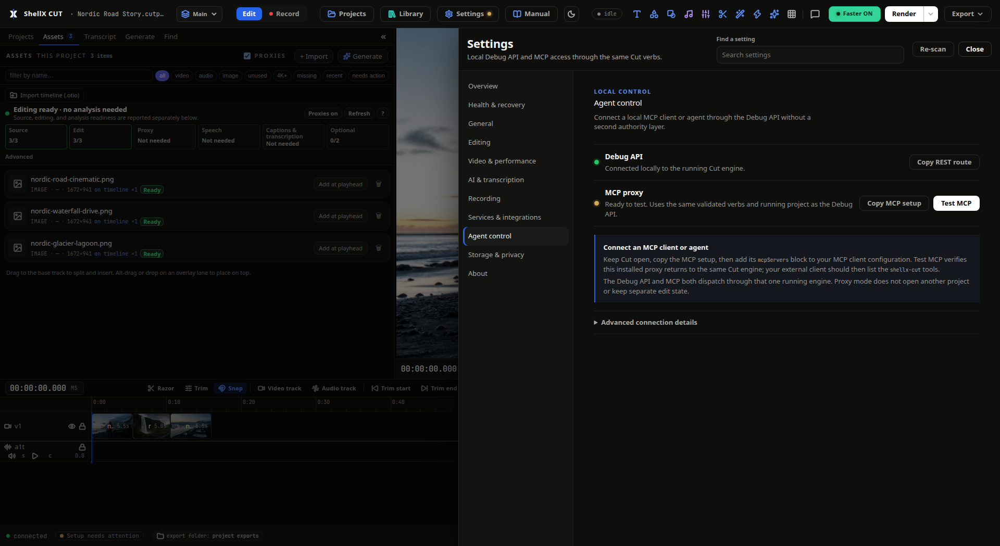

# ShellX Cut


**Agent-first video editor.** An agent and a human co-edit one timeline through
the same verb API. Every change, human or agent, is an operation in an
append-only log with a rationale. AI passes are reviewable, scoped, reversible
diffs, and "done" requires measured evidence: render receipts, deterministic
checks, sampled-frame review, transcript timing, loudness, silence, and delivery
facts. ShellX Cut makes the edit itself a verifiable object instead of treating
AI output as an opaque final file.

<!-- shellx-cut-release-truth: candidate; version=0.6.114; published=0.6.113 -->
> **STATUS — v0.6.114 candidate; v0.6.113 is the latest published release.**
> The public contract is 308 verbs across 34
> domains. The schema-generated REST and MCP surfaces share one registry,
> typed UI bindings are checked by `scripts/verbargs-sync.sh`, and the full
> agent reference is in `skill/shellx-cut/reference.md`. Current major surfaces
> include Projects, Library, native editable Generate, cited Find moment search,
> transcription with exact time-linked ranges,
> Parakeet/Canary/Whisper tiers, dubbing, diarization, render verification,
> review comments, Recording Studio workflows, and setup cards for installable tools and
> model runtimes, and a locked exact-frame Before/Current Preview comparison.
> Provider-backed media generation remains optional via the
> user's own CLI; native Generate produces editable timeline elements through
> normal ops.

## See ShellX Cut in action



| Edit the live timeline with Codex in plain language | Connect any MCP-capable coding agent |
| --- | --- |
|  |  |

Agent Chat supports the user's installed Claude Code, Codex, Grok, or
Antigravity CLI. Provider version text is informational only; each resolved
CLI must advertise Cut's required Agent Chat flags before every turn.
Claude uses Cut's contained capability route with its required containment flags;
Codex uses the selected account's Codex configuration, native sandbox, and
permissions; when an alternate account is enrolled, Cut passes its account
home to the Codex child through `CODEX_HOME`. Grok runs from a disposable
config and home with native tools disabled and only Cut's MCP route available;
Cut trusts only that newly created empty workspace for the duration of the turn
so Grok can start its project-scoped Cut MCP server.
Antigravity keeps the user's normal settings and login while
Cut starts a new disposable project containing one Cut-only MCP plugin. Its
headless approval mode is bounded by that empty sandbox and Cut's filtered
server-side verb policy. Cut does not copy or rewrite provider login files. Each route can inspect the
open project and make reversible in-project edits. Timeline **Ask agent** and
Comment **Make changes** carry an immutable target; a validated result applies
directly. Use **Step back** only while its guarded whole-turn revert remains
safe, or **Ask replacement** to re-resolve the retained target. There is no
Draft, Accept, or editor approval stage.

## Quickstart

> **Installing:** v0.6.113 is the current published installer/package from the
> GitHub release. Users already on 0.6.107 can use the
> in-app update when it is offered. Versions older than 0.6.107 must install
> 0.6.107 manually before using the in-app update.

Contract first: read `docs/public/FEATURES.md` for the public feature inventory and
`schema/verbs.json` for the verb registry, which is the source of truth for the
debug/API contract. The Manual button and contextual Guide actions open the
bundled interactive guide at the relevant article. Reading an article never
changes the editor; **Show in Cut** is the separate, explicit
reveal-and-highlight action. The currently published online page at
`https://docs.theshellx.com/manual/cut/` is the stable reference page. A
separately staged real-frontend preview uses the same indexed content and a
read-only compiled Cut surface so users can inspect menus and controls without
changing a project before that preview replaces the stable route.
Agent workflow details and full arguments live in `skill/shellx-cut/SKILL.md`
and `skill/shellx-cut/reference.md`. Build prerequisites (Rust, Node, ffmpeg,
jq, and Linux capture/audio development headers) plus the full verification
gate list are in `docs/public/BUILDING.md`.

The first-run path is project-first and format-light: Projects is the initial
workspace, and dropping a video, audio file, or image when no project is open
creates a sensibly named project and places the media on its timeline. A new
project does not ask a beginner to choose resolution or frame rate. Its first
video adopts the source geometry and frame rate; those are timeline composition
properties available later under Render > Timeline. Delivery aspect, output
size, codec, and bitrate remain per-render/export choices, so one edit can
produce multiple deliverables without recreating the project.

```bash
scripts/dev.sh                  # build ui/ bundle, run cutd serving it at 127.0.0.1:6161
scripts/dev.sh --headless       # API-only, no UI build (background-run friendly)
node scripts/generate-verb-contract.mjs --check
                                # schema behavior metadata matches generated core/history, UI, and dispatch contracts
node scripts/schema-validation-parity.mjs
                                # exact invalid-argument parity across direct dispatch, REST, CLI, and MCP
scripts/verbargs-sync.sh        # asserts every verbs.json verb has a typed UI client binding
npm --prefix ui run test:lib    # focused public UI contracts
npm --prefix ui run build       # typecheck and production bundle
node --test scripts/public-tests/*.test.mjs
                                # source-only public contract suite (no installed app claim)
node scripts/check-public-test-inventory.mjs --run
                                # classify and run the source-safe public test set
scripts/make-test-assets.sh     # espeak-ng+ffmpeg → testdata/ with known ground truth

# cutd directly (cargo run -p server --manifest-path app/Cargo.toml -- …):
cutd serve --project x.cutproj --headless   # REST+WS server, UI optional
cutd serve --addr 127.0.0.1:6169 …          # non-default port (loopback only); all 6161 URLs below shift accordingly
cutd mcp                        # MCP over stdio; PROXIES a running serve (the single-state-holder contract)
cutd verb project.state '{}'    # one-shot CLI escape hatch
```

The focused context-menu contract is deliberately smaller than the full UI
matrix. It checks exact linked A/V identity (including independently trimmed
near-matches), generated title/shape menus, media grouping, captions, and the
surface-specific menus. Empty-timeline actions use the clicked time; gap actions
only seek/select/fill that exact gap; locked tracks allow inspection, unlock,
and confirmed removable overlay tracks but no clip edit. Preview routes only an
unambiguous base asset to Source Monitor, and Assets/Projects retain the exact
clicked row identity. Native custom speed accepts the engine's 0.25–4× range
without prompt parsing or menu-only rounding. All new menus clamp to the
viewport and dismiss with Escape.

For source navigation, select a footage clip or open a video track-header menu
at the playhead and choose **Match Frame**. It opens the Source Monitor on the
exact source frame for normal, reverse, and freeze playback; speed ramps and
offline/missing sources remain disabled with a reason. A track header also
stays disabled where more than one video clip overlaps the playhead; select a
clip directly to choose its exact frame. In Source Monitor,
**All uses** is UI-only navigation over the existing per-asset Sequence Index:
choose a listed occurrence to switch sequence and seek its clip start. It does
not promise ramp-exact source matching; each listed `at_ms` is the laid clip
start after any upstream crossfades, and its exact asset filter applies before
the 500-occurrence cap. Assets can also open an online still image in that same
monitor. It previews the actual image and offers a bounded duration plus an
unlocked video destination or Off for **Overwrite still** at the visible
playhead; it never presents that still as timed media or offers an audio target.
Both that monitor and a footage clip menu can **Reveal in Project** or **Reveal
in Library**, clearing local filters and selecting the exact registered asset in
the existing surface. **Reveal Source File** is desktop-only: the shell resolves
the current server-registered asset identity itself before handing a local
regular file to Finder, File Explorer, or the Linux file manager. Browsers,
missing/offline/non-file sources, and removed registrations refuse with a
reason; source paths are not displayed or accepted from the UI.

Run the public model/source check with `npm --prefix ui exec tsx
public-tests/clip-context-menu.test.ts`.

REST: `POST /api/verb/{name}` · `GET /api/state` · `GET /api/frame?at_ms=` ·
WS events at `/api/events` · UI served at `/`. MCP tools are generated from
`schema/verbs.json` (dots→underscores). Full endpoint catalog, MCP client
config, and the security model in `docs/public/DEBUG_API.md` — cutd is
**loopback-only by design, no API token**. The supported default is one
personal workstation / one trusted interactive environment: loopback is a
machine-wide reachability boundary, not same-user authentication, so any local
process or OS account able to connect can operate the editor. Origin/Host guards
mitigate browser cross-origin and DNS-rebinding requests, not native callers
that can omit or forge those headers. Native LAN/public listening is unsupported
and refused by default. In debug builds only,
`SHELLX_CUT_ALLOW_NON_LOCAL=1` permits a non-loopback bind and skips the
browser Origin/Host/Fetch-Metadata guard; packaged builds ignore the flag.
Remote use is supported only through an independently authenticated and
authorized SSH/VPN/external ShellX broker or equivalent transport; without that
protection it must be refused. The protection belongs to that transport, not
Cut. See
[`docs/public/shellx-cut-threat-model.md`](docs/public/shellx-cut-threat-model.md)
for the supported deployment and residual risk.

## Verb API (308 verbs, 34 domains — `schema/verbs.json` is the contract)

Envelope: `{ok, result?, op_ids?, project_revision?, warnings?[], error?{code,message,clip_id?,at_ms?,cause,suggested_action?}}`.
Every mutating verb takes optional `rationale`. Long tasks return `{job_id}`.
Every verb also advertises shared optional `request_id` and
`expected_revision` controls. Op-emitting mutations persist the caller request,
reject stale revisions atomically, and return the original durable response for
an identical lost-response retry; changed payloads conflict.
Representative verbs per domain below — `skill/shellx-cut/reference.md` is the
full 308-verb table.

Color management uses `project.color` and `edit.color_space` for the explicit
Rec.709, Rec.2020, sRGB, and scene-linear spaces. It is a lightweight
conversion path, not camera Log interpretation or HDR mastering/delivery.

| Domain | Verbs | Notes |
|---|---|---|
| **project** | create · open · save · state · **health · cache_preview · cache_rebuild · cache_purge · package_plan · package_create** · **sequence_list · sequence_index · sequence_create · sequence_switch · sequence_rename · sequence_delete** · ops · **group_preview · group_reject** · checkpoint · revert · **undo · redo** · diff · **rename · brand** · close · **list** · **forget** · **delete** | each project can hold independent sequences with scoped undo/checkpoints while sharing media; **health is a read-only, revision-bound, path-free Health & Recovery page for journal recovery evidence and registered source/proxy/filmstrip checks; aggregate all pages before calling the project healthy, and continue only while `has_more` supplies `next_cursor`. Settings reads capture recovery separately through `screen_record.recovery_status`, then labels all of this evidence as reported in that check rather than a timeless snapshot**; **cache_rebuild is a bounded, cancellable non-destructive backfill for missing or stale ledger-owned base proxies/filmstrips: it rechecks current source identity, reserves ownership before output, returns queued/up-to-date/items-needing-attention counts without paths, and leaves a pending reservation for safe later resume after cancellation or restart. cache_preview is a separate read-only ownership check and cache_purge starts only after an exact one-use preview confirmation: it may remove only aged, unreferenced, ledger-owned flat proxy/filmstrip files, and fails closed on legacy, foreign, symlinked, partial, or changed roots. Sources, exports, captures, and receipts are never candidates**; **group_preview/group_reject are the agent-only review boundary for an existing adjacent compound action: the revision-bound reject is tip-only, appends one normal restore, and never generically replays selected history**; **package_plan/package_create are the human-confirmed portable-project workflow: they include only referenced media, deduplicate exact content, exclude regenerable caches, refuse offline or stale inputs, and publish a new Cut-native package without replacement while leaving the source unchanged**; **sequence_index searches path-light clip/marker metadata across every active and inactive timeline, filters live offline media/gaps/effects/hidden/locked/muted tracks, copies the bounded table as spreadsheet-safe CSV, and navigates results from Find → Sequence**; checkpoint/revert/undo/redo are append-only ops; revert appends one materialized target-timeline result, never rewrites; rename and brand are durable non-timeline metadata ops; **brand stores delivery constraints used automatically by verify.brand and render.bundle**; **list = recent-projects index (~/.shellx-cut/projects.json), reopen by path; forget drops the index entry (≠ delete); delete PERMANENTLY removes the `.cutproj` dir + forgets it (guardrailed: only `*.cutproj`, never the open project)** |
| **library** | **list · add · remove · move · tag · favorite · use · add_to_project · folder_add · folder_rename · folder_remove** | global cross-project media library (~/.shellx-cut/library/): video/audio/image, folders + tags. HYBRID storage (link original by path, or copy:true → content-addressed stored copy); kind is ffprobe-derived; add_to_project reuses media.import. Assets is project-local; human Assets imports mirror explicitly, while agent imports use `library.add {asset}` only when cross-project reuse is intended. Blobs served fenced via /api/library-blob |
| **assets** | providers · search · fetch · generate · generated_list | Find media reads the matching server's source catalog (local folders, Openverse, Internet Archive, Wikimedia, NASA, and offline built-in stickers), shows each source's valid kinds plus license/credit before import, and keeps normal project import paths; network sources are contacted when you search or import a result |
| **media** | import · **remove** · probe · transcribe · perception · waveform · **filmstrip · relink_preview · relink_apply** | import kicks probe→proxy→filmstrip→**ready-to-edit** (fast); transcribe+perception run as a separate background **enrich** job (`enrich_job` in the result) so slow transcription never blocks editing; first import auto-places onto an empty timeline; filmstrip = per-clip timeline thumbnails; **remove = the inverse of import — drop an asset from the open project + unlink its regenerable proxy/thumbnails (source file kept, replay-safe; refuses while clips still use it)**; **relink_preview/relink_apply scan an explicitly selected folder and repair only uniquely exact SHA-256 matches through a preview-bound atomic receipt; a strong metadata hint is disabled and routes to normal one-file Relink**; the Assets tray includes Media Health for missing sources, proxy/source playback state, and one-click relink |
| **jobs** | status · list · cancel · **retry** | one durable job model for transcribe/perception/render/judge, with explicit cancellation for active tasks; **retry** accepts only source-declared safe descriptors, revalidates the original input fingerprint, preserves lineage, and never guesses arguments from an error record |
| **edit** | split · ripple_delete · trim · move · insert · **insert_linked** · **overwrite** · gain · **keyframe** · **speed** · **grade** · **grade_stack** · **color_match** · **auto_balance** · crop · transform · fade · crossfade · duck · **auto_zoom** · multicam_sync · **multicam_switch** · add_track · **remove_track** · split_at_scenes · mark_scenes · trim_edges · add/remove/move_marker · restore | **remove_track** removes an empty overlay track (or explicitly removes its clips with `force:true`); optional `group_id` keeps it in the same Undo step as the clip deletion that emptied it. A probed video with audio uses **insert_linked** to validate both typed destinations (or create them), the shared source range, and the paired insertion as one reversible edit; failure leaves no partial picture, sound, or track. Linked imported picture/sound move and trim atomically by default (`linked:false` deliberately separates them); **overwrite** replaces a source-duration interval on explicit video/audio targets without shifting downstream time (both targets are one atomic A/V edit; it is not `insert {ripple:false}`); **keyframe** is the replay-safe clip automation primitive; the audio Inspector exposes volume control points in clip seconds (dispatched as exact ms) while the Layer drawer owns picture motion; the compact point editor is not a full timeline lane, which remains future work; restore = undo/reject (tip or rebase); speed = per-clip retime; grade = color; **grade_stack** = LAYERED grading (a node-stack of grade layers applied in order on one clip — a serial grading workflow; empty/single-layer stays byte-identical to a plain grade); **color_match** = match a clip's colour to a reference clip (derives + applies a grade); **auto_balance** = one-click REFERENCE-FREE auto white-balance + exposure (the "Auto Color" sibling — neutralises the clip's own cast, no reference; derives + applies a grade); **auto_zoom** = emphasis-driven punch-in zooms (loud beats / sentence starts → scale keyframes); multicam_sync = audio-align angles, **multicam_switch** = auto-cut the program to the active-speaker (loudest) angle over time |
| **effects** | list | read the built-in effect catalog used by Inspector and agent workflows |
| **transitions** | list | read the supported transition catalog before applying timeline transitions |
| **grade** | **save · apply · list** | grade GALLERY (the grade gallery — "copy a look between shots"). **save** snapshots a clip's current grade as a named project preset; **apply** copies a saved look onto a target clip (lowers to a replay-safe `edit.grade`); **list** reads the gallery. Pure data — `save` is a non-timeline metadata op, `apply` is the undoable per-clip grade |
| **audio** | add_music · cleanup_voice · **dub** | music bed + auto-duck under speech + beat:N markers; **dub = native AI dubbing — re-voice an asset's speech into another language in a cloned voice, time-fit to the original, added as a NEW audio track (original kept); reuses transcript.translate, synthesizes via the OmniVoice TTS service (CUT_DUB_ENDPOINT)** |
| **transcript** | get · cut_words · **ignore_words** · remove_silences · remove_fillers · search · assemble | text-based editing; never cuts inside a word; `ignore_words` hides selected source words from transcript-derived captions/reels without cutting or muting; `aggressiveness` REQUIRED on remove_silences; assemble builds a highlight reel |
| **captions** | generate · add_text · **bulk_preview · bulk_apply** · **kinetic** · set_style · set_range · shift · reflow | static burn-in + animated kinetic captions: Lines uses caption cues; One word at a time uses a timeline transcript; reviewed Find & Replace pins a track/range preview and applies it in one Undo step; reflow satisfies verify.captions |
| **title** | **add** | native motion-graphics title (resvg, in-house) — animated, distinct from captions.add_text's static card |
| **shape** | update | update a placed native shape without recreating its clip identity |
| **generate** | **list · describe · preview · insert · from_prompt · storyboard** | native editable Generate workspace beside Library: built-in templates, Motion-backed rendered templates through `motion.template_to_cut`, scripted-video renders through `motion.script_to_cut`, and attested/idempotent connector plans through `motion.map_import` / `motion.apply_import`; current SDK renders carry verified two-/five-hash package lineage and replay-backed path-free origin attestations, while an optional current package is independently reported as `exact`, `changed`, or `unavailable` and older connector plans are labeled `legacy-unverified`. Motion receipt `warning` is accepted as successful with deduplicated advisories; failed receipts are rejected. Supported Motion backgrounds/text/shapes plus opacity and x/y position automation arrive as normal editable Cut objects with stable source-layer bindings and changed plans update those objects in place, while unsupported constructs retain rendered-media fallback. Background apply is cancellable through `jobs.*`; distinct from `assets.generate`, which imports provider-backed media through the user's Codex image, Grok Imagine image/video, or Antigravity (`agy`) image CLI; Antigravity retains its native sandbox/non-interactive contract and is not advertised for video |
| **motion** | **job.get · job.list** · link.refresh · link.relink · link.edit · **link.tracking.inventory/request/inspect/apply/verify/detach** | Motion-backed renders can be named with `job_id` and observed live from another request without exposing cross-caller scope: `pending` is waiting for capacity, `running` is active, and polling stops when `pollAfterMs` disappears. Linked Motion clips keep a last-good rendered Cut fallback while Canvas owns rich source editing. Cut supplies a stable path-private workspace caller id, distinguishes deliberate render cancellation from retryable machine-busy queue timeouts, and retains the supported on-disk Motion render receipt path on refresh. The Inspector exposes bounded path-free keying/roto facts, can run local point/planar analysis on package footage, compile stabilization to ordinary Motion keyframes, verify or detach it, and only updates pixels after an explicit receipt-verified refresh. Tracking uses normalized seeds, copy-on-write packages, fixed argv, and identity/race checks |
| **render** | preview · frame · final · **reframe** · storyboard · **bundle** · **queue** | `frame` = agent's eyes; `final` auto-runs verify.checks → RenderReceipt; `final` does multi-format STATIC geometry (`aspect`/`width`/`height`, centre-crop) + `format` (h264/hevc/vp9/prores/av1) + GPU `hardware` tier + rate-targeted `bitrate`/`rate_control` (vbr/cbr) + `normalize_loudness`; **`reframe` = subject-aware auto-reframe (local CV detect+track → moving crop that FOLLOWS the subject; honest lossy-crop receipt) — the honest alternative to a static centre-crop**; **bundle = social repurposing: one window → publish-ready pack per platform (reframe + windowed captions srt/vtt + thumb + receipt)**; **queue = BATCH DELIVERY (a batch render queue): fan the current timeline out into N renders with per-entry settings (`output`/format/preset/bitrate/geometry/loudness), run SEQUENTIALLY through the same `render.final` path (memory-safe — N at once would multiply peak RSS); a pure delivery orchestrator (no op, no checkpoint), entries validated up front by a dry_run; per-entry job_ids + receipts land in the queue job result** |
| **clip** | **candidates** | rank the windows most likely to work as standalone short-form clips (honest heuristic: opening-hook + retention proxy) — read-only, feeds render.bundle |
| **score** | clip | model-free engagement scoring used to explain and rank clip candidates |
| **assemble** | repurpose · shorts · from_script · broll | human-visible Assemble workflows for highlight selection, short planning, script-to-footage matching, and b-roll placement; every applied result remains normal timeline ops |
| **autopilot** | **run** | workflow: render → verify → MECHANICALLY self-fix from the receipt's fix_actions → re-verify, capped, under one auto-checkpoint (one-step revert). policy:preview (plan only) \| auto_low_risk (apply). Never fakes a pass; no-progress guard |
| **recipe** | **list · describe · run** | declarative pipeline MANIFESTS — named, gated WORKFLOWS over the existing verbs (built-ins in `schema/recipes.json`: a guided first edit; preview-first **Edit for clarity** with intensity; podcast/talking-head/screen-demo/phone cleanup; social bundle; privacy mask; captions; YouTube and TikTok export). list/describe are pure reads; **run is a PURE ORCHESTRATOR** (like autopilot.run/audio.cleanup_voice): no op of its own, ONE auto-checkpoint (one-step revert), dispatches each stage through the normal verb path, polls sub-jobs, evaluates a per-stage gate (receipt checks and/or render-free state facts), and STOPS + reports on the first failed verb or gate. policy:dry_run returns the resolved PLAN without dispatching (pre-render-gate seam) |
| **screen_record** | doctor · **microphone_selection · system_audio_probe** · **preview_capability · preview_start · preview_status · preview_frame · preview_pause · preview_resume · preview_hide · preview_stop** · **rehearsal_start · rehearsal_discard** · start · **live_frame · status · pause · resume** · stop · **recovery_status · copy_raw · studio_event · scene_activate · scene_timer** · autoedit · polish · export | Recording Studio uses System Default by default; on Windows/macOS a human can select current opaque microphone and camera choices while native identities remain private. The source preview and active-take live frame use real native pixels, with explicit unavailable/stale/recursion states. A bounded rehearsal can be played and discarded without creating project media. Camera is explicit, Auto-edit-only, and recorded as a separate editable take with shared-clock metadata rather than baked into the screen source. Named Screen and Presenter PiP scenes can switch during capture, with one elapsed/countdown timer whose saved transitions use that same recording clock. Compatible macOS display recordings can pause and resume through the durable native owner. `screen_record.status` is a short-lived, process-local read: readiness follows a real native screen frame; selected-source loss is reported only when an armed exact-source close beats a Cut-owned close; controller placement returns only a confirmed exclusion/hide, refusal, or unavailable conclusion; and mic/system meters observe only already-admitted streams. Missing permission, no first frame, stale or lost audio, and device loss remain explicit rather than falling back or guessing. Both Raw and Polished modes save the unchanged MP4 in the default export folder; optional destination selection occurs only after Stop through Export or Save a copy. A failed Stop retains its capture and offers recovery for that same capture. Acknowledged Stop releases capture ownership, so a later auto-edit or polish error is not a live capture. |
| **voiceover** | start · tick · stop · cancel · observe_playhead | Timeline-track voiceover remains disabled unless the current Record Doctor admits native capture. The server binds one current unlocked audio track and playhead/In–Out range to a retry identity, then issues a memory-only per-tab owner claim for every tick, Stop, Cancel, and correlated Preview Out. An exact active A retry wins over later ordinary revision changes; a different B remains refused while A is active, and only `voiceover_start_retry_rejected` lets the UI discard its non-secret retry identity. It counts in, correlates exact request/fingerprint/epoch playback, and only places a sealed WAV as one asset-plus-clip operation (one Undo). Direct monitoring is off; Cancel and unplaceable outcomes add no edit. |
| **verify** | checks · **rerun** · judge · pregate · pacing · captions · delivery · brand | checks = deterministic instrument battery (post-render); **rerun rechecks the exact immutable rendered bytes from a selected receipt, re-fencing and re-hashing the output before and after its owned sidecar/probe, then writes a separate verification receipt without re-rendering or replacing the source receipt; it intentionally excludes source-, caption-, word-cut-, and current-timeline checks**; judge = optional visual reviewer (job; normalized approve/reject/advisory outcome); **pregate = PRE-render predictive gate — flags likely render problems from the EDL + cached perception facts WITHOUT spending a render**; pacing/captions/delivery/brand = read-only QC receipts |
| **export** | xml (fcpxml/premiere/resolve) · srt · vtt · chapters · transcript · frame · range · **audio** · **gif** · **publish** | file-writing paths are FENCED (the output-fencing contract); users can set a default export folder or use per-export Save As, default-name collisions auto-suffix, and confirmed Save As targets can replace existing export media/sidecar files; frame/range extract a still / a timeline window AS reusable assets; **audio = timeline mix as mp3/m4a/wav/flac/opus; publish = one-click platform export (youtube/tiktok/reels/x/…) using platform geometry and bitrate presets through render.final** |
| **import** | otio | hash-bound OTIO preflight and one-operation timeline replacement; the desktop UI owns the native picker/confirmation while agents pass an explicit path |
| **inspect** | media · range | path-light, cited inspection over the current project and its exact MediaEvidenceIndex; resolves opaque evidence hits to current source ranges and timeline occurrences, and refuses stale, foreign-project, or changed evidence instead of summarizing old prompt context |
| **comment** | add · list · draft · apply · resolve | editor **Make changes** routes a timecoded note and immutable target through Agent Chat; `draft`/`apply` remain compatibility/debug APIs, never an editor approval flow |
| **agent** | chat | launch the user's configured subscription CLI against the same MCP-backed live project; direct validated results retain a bounded turn receipt with guarded **Step back** and **Ask replacement** |
| **ui** | state · screenshot · open · playhead · select · highlight | ui.screenshot is a verification PRIMITIVE — agent sees the app from anywhere; open/playhead/select/highlight return `ok:true` only after the exact UI client commits observable state; no-op/unavailable/disconnected requests fail explicitly; one shared registry covers human and agent surface routes |
| **debug** | screenshot | compatibility screenshot primitive for external harnesses; normal agents should prefer `ui.screenshot` |
| **plugins** | list · enable · call | agent-only scoped-dispatch fence over the same registry; `plugins.list`, `plugins.enable`, and `plugins.call` expose built-in Openverse-assets and matte-runtime capabilities without creating a parallel API |
| **system** | **system.mcp_test · system.doctor · system.motion_status · system.fetch_tool · system.setup_perception · system.setup_matte · system.set_ffmpeg · system.set_stt_model** | Agent control plus environment/setup cards: Settings > Agent control discovers the exact installed executable, copies a ready MCP client config, and runs a read-only initialize/ping/tools/list/same-engine proxy check; capability cards cover ffmpeg, perception/STT, matte, dubbing, diarization, judge CLIs, and disk health. `system.motion_status` is a separate fixed read-only runtime/catalog/descriptor check: a discovered checkout, PATH binary, or npm package remains unmanaged and connector execution-unqualified. Install, Repair, Update, and Remove remain unavailable until `MOTION-DIST-01` supplies a verified immutable platform manifest and matching artifact; setup remains consented and local-first |

### Advanced visual-index API

`media.index` is an explicit advanced API operation that creates legacy visual
embeddings. It needs the local perception runtime and SigLIP2 model; ordinary
installed mode uses optional `torch` and `transformers` extras with
`AutoModel`/`AutoProcessor` resolution for default
`google/siglip2-base-patch16-224`. Cut has no separate SigLIP fetch/install
card. Find Moment's **Prepare search** consumes existing visual embeddings and
never silently starts visual indexing.

WS events: `op_applied · job_progress · render_done · receipt_ready · project_changed · ui_state · doctor_updated`
— `receipt_ready` always follows `render_done`; agents key on `receipt_ready`.
`project_changed` keeps visible clients synchronized when REST, CLI, or MCP
creates, opens, or closes the active project.
`doctor_updated` refreshes setup/status surfaces when detected capabilities
change.

## Network activity

ShellX Cut is local-first. Projects, media, edit history, previews, and normal
renders stay on the machine. Optional generation, dubbing, review, stock-media,
or agent-provider workflows make network requests only when the user starts
them.

The installed desktop app on Windows and macOS also contacts GitHub by default
to read the signed release feed: once at launch, then once every 6 hours while
the app stays open. GitHub receives normal request metadata such as the IP
address; Cut adds no project, media, edit-history, or analytics payload.
Finding an update never interrupts the session — it only shows a quiet topbar
button and the update status in Settings > About, and installing an available
update still requires confirmation. Automatic checks can be turned off under
**Settings > Storage & privacy > Network activity**; the choice is stored by
the native shell, applies immediately to both the launch and periodic checks,
and the manual "Check for updates" button in Settings > About keeps working.
Linux packages (deb/rpm) skip the launch and periodic update checks entirely —
updates arrive as new package downloads — so a Linux launch makes no GitHub
request at all.
Windows and Apple-silicon macOS updates are signature-verified before install;
the release feed is generated only from both verified platform artifacts and
version-bound GitHub release URLs. Source-build and packaging steps are documented
in [`docs/public/BUILDING.md`](docs/public/BUILDING.md#official-release-packages).

## Security

Read [`SECURITY.md`](SECURITY.md) and the
[local-machine threat model](docs/public/shellx-cut-threat-model.md) before
exposing the Debug API beyond loopback or enabling unattended agent control.
The brokered Agent Chat routes are distinct from the machine-wide local
REST/MCP trust boundary; their review and revert controls do not constitute an
operating-system sandbox.

## Architecture

```
app/  cargo workspace
├── core/        cut-core: project model, op-log, EDL, checkpoints, diff, receipt types
├── media/       cut-media: ffprobe/proxy/render via ffmpeg subprocess; ASS caption burn-in
├── export/      cut-export: NLE interchange — FCPXML 1.11 (FCP/Resolve) · xmeml v5 (Premiere) · SRT
├── perception/  cut-perception: instrument orchestration + deterministic receipt checks
│   └── py/      python sidecar: Parakeet/Canary/Whisper words, silero-vad, PySceneDetect, WAV-energy beats, ebur128
└── server/      cutd: axum REST+WS on 127.0.0.1:6161 + MCP + jobs + static ui/dist

ui/   Vite + React + TS — an API client, NOTHING more. Zero local mutation:
      every interaction dispatches a verb; state arrives over WS. Panels:
      Timeline · Preview · project-local Projects/Assets/Generate/Transcript tabs ·
      dedicated cross-project Library workspace · Review rail · status bar.
      Design follows the public feature-surface contract and the local UI rules:
      compact operational panels, stable selectors, wired controls, and
      advanced diagnostics hidden until needed. Recording source choice keeps
      Display and Window as separate target classes; Region stays hidden until
      a real native picker is available.
```

Headless-first: `cutd` runs without UI; open the UI at any moment and see live
state. Renders are deterministic (fixed encoder params, no wall-clock
metadata): same input + EDL ⇒ same output hash.

## The receipts model (the whole point, in 10 lines)

1. Every mutation goes through a verb; every verb appends an immutable op
   record to `ops.jsonl` — actor, args, **rationale**, effects, and (only for
   historic snapshot-era records) an optional inverse payload.
2. `project.json` is only a cache, rebuilt from the log on demand.
   Project opening limits `ops.jsonl` to 128 MiB total and 8 MiB per record;
   an oversized `project.json` cache is skipped and rebuilt. If an older,
   legitimate project exceeds a journal limit, keep an untouched copy and
   migrate or split it in a trusted compatible environment before reopening.
   Do not truncate or hand-edit the operation journal to make it fit.
   Oversized derived receipts and recording journals are rejected separately;
   keep the original project, then regenerate the affected analysis or recover
   the recording from a trusted copy.
3. Ctrl+Z/Ctrl+Shift+Z use `project.undo`/`project.redo`; review rejection uses
   `edit.restore`. A reviewed adjacent compound action may instead use the
   revision-bound, tip-only `project.group_preview` / `project.group_reject`
   pair, which appends one normal restore and never replays an arbitrary set of
   historical operations. History is never rewritten.
4. Checkpoints are pointers into the log; diff = ops between two pointers.
5. Imported assets get `perception.json`: measured facts (word timestamps,
   silences, scenes, beats, LUFS) from local instruments.
6. `render.final` auto-runs `verify.checks` — deterministic Rust checks over
   EDL × facts × output (cut_on_word, lufs, caption_presence, black/frozen
   frames, silence_at_edges, duration_matches_edl) → **RenderReceipt**.
7. `verify.rerun {render_id}` rechecks only facts available from that exact
   persisted output: it re-fences and hashes the bytes, runs loudness,
   black/frozen, border, edge-silence, and receipt-duration checks under one
   cancellable job, then writes a separate immutable verification receipt. It
   never re-renders or substitutes the current timeline for historic evidence.
8. `verify.judge` adds an optional visual-review layer over sampled frames and
   deterministic instrument facts (LUFS, silences, and word timings remain the
   measured ground truth; `listened:false`). It accepts Claude, Codex,
   Antigravity, and Grok backend IDs, but v0.6.114 admits only Claude with a
   restricted Read-capable version (at least 2.1.248) and a safe copied-frame
   workspace, or Grok with version 1.0.21 or later and its no-model-tools
   policy. Codex and Antigravity may be detected as installed yet return the
   honest `not_run` reason `render judge unavailable until restricted tool/file
   access is verified`; this affects only render judging, not Agent Chat or
   generation. Auto keeps the configured Claude → Codex → Antigravity → Grok
   order while skipping unready rungs; an attempted ready-rung infrastructure
   error may continue to the next ready rung. A named backend never falls back.
   `not_run` is unreviewed, never a pass. An explicit `CUTD_JUDGE_ADAPTER`
   remains an operator/test override. Provider admission is not a claim of a
   live model turn or native qualification.

## Repo map

| Path | What |
|---|---|
| `app/` · `ui/` | Rust workspace + React UI (see Architecture) |
| `schema/` | verbs.json (verb registry, source of truth) · ops.schema.json |
| `docs/public/` | feature inventory/workflow, build/debug guides, contributor verification, and ShellX Motion boundary |
| `scripts/` | development, contract-check, and unsigned packaging tools |
| `scripts/public-tests/` · `ui/public-tests/` | deterministic contributor-facing verification suites |
| `skill/shellx-cut/` | agent tool skill (SKILL.md + reference.md) + craft/ layer (11 editing-craft guides: talking-head cleanup, podcast, screen-demo, pacing…) |
| `branding/` | selected ShellX Cut vector and raster icon masters |

## License

ShellX Cut is MIT licensed (see `LICENSE`). Shipped third-party model and font
assets use permissive licenses recorded, with source hashes and license texts,
in `NOTICE`.

FFmpeg is not included in ShellX Cut installers. Users can provide a compatible
system copy or explicitly ask Cut to download a separate BtbN GPL build on
supported platforms; that external runtime keeps its own license and runs as a
separate process. See `NOTICE` for the exact boundary and upstream links.

## Credits

Created by Martins Brezauckis. ShellX Cut edits locally on your machine and
can be co-driven by AI agents — Claude Code, Codex, Grok, or any REST/MCP
client — through the same validated verb surface the UI uses. Third-party
models and fonts shipped inside installers are credited, with license texts
and source hashes, in `NOTICE`.
